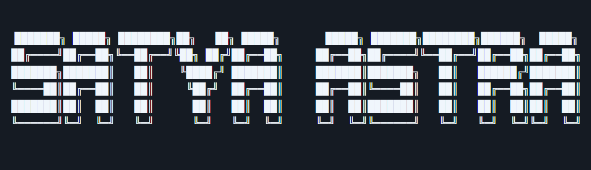

<div align="center">


 


<br/><br/>


<div align="center">
  
</div>


# SATYA-ASTRA

### **S**trategic **A**rtificial Intelligence **T**actical **Y**ield **A**nalytics for **A**dvanced **S**ecurity, **T**hreat **R**econnaissance & **A**llocation

**India's First Real-Time Deep-Tech Military Deepfake Intelligence and Cognitive Warfare Platform**

<br/>

[](https://python.org)
[](https://pytorch.org)
[](https://fastapi.tiangolo.com)
[](https://reactjs.org)
[](https://bhashini.gov.in)
[](./LICENSE)

<br/>

> *"In a nuclear-armed South Asian theatre, a single convincing deepfake of a military commander — undetected for even 30 minutes — can trigger irreversible diplomatic or military escalation. The cost of inaction is not measured in rupees. It is measured in lives."*

</div>

---

## Principal Investigator

**Raj Bhadani**
B.Sc. (Hons.) Computer Science · Expected  June 2026
Deshbandhu College, University of Delhi · GPA: 7.0 / 10

📧 rajbhadani9897@gmail.com | [LinkedIn](#) | [GitHub](https://github.com/rajbhadani9897)

### Relevant Technical Skills
- **ML / AI:** PyTorch, TensorFlow/Keras, Scikit-learn, OpenCV, transfer learning, model deployment
- **CV / NLP:** CNN image classification, ResNet-18 (71% accuracy on FER-2013), IndicBERT, spaCy, NLTK
- **Data:** Pandas, NumPy, Power BI, ETL pipelines, feature engineering
- **Tools:** Jupyter, Git/GitHub, Google Colab, Kaggle, REST APIs, Bhashini API

### Demonstrated Prior Work (Relevant to SATYA-ASTRA)
| Project | Stack | Result |
|---|---|---|
| Facial Expression Recognition | ResNet-18 + PyTorch | 71% test accuracy on FER-2013; +9pp over baseline CNN |
| Tesla Stock Forecasting | Facebook Prophet | MAE 4.2, RMSE 6.8 on 90-day hold-out |
| GHG Emission Prediction | XGBoost / Random Forest | R² = 0.91 |
| Diabetes Classification | Scikit-learn | AUC-ROC = 0.87 |
| Social Network Analysis | NetworkX | Betweenness/eigenvector centrality on 2,000-node health network |

### Leadership
- **President**, Cybernauts CS Society 2024–25 — led 30-member team, SYNTAX'25 fest (200+ participants)
- **IT Head**, Unnat Bharat Abhiyan (UBA), Deshbandhu College — Government of India rural development initiative

### Research Output
> **Bhadani, R. & Pratyaksh** — *Social Network Analysis in Public Health, Security, and Social Media Contexts*
> DSE Research Methodology, Deshbandhu College, University of Delhi (2025)
>
> Synthesizes SNA applications across three domains: multisectoral tobacco governance (India), COVID-19 mask discourse (452K tweets), and terrorist network mapping (61 organisations). Applied betweenness centrality to identify ISI's brokerage role (score: 12.6) and top-10 hidden influencers in a 2,000-node health network.
> Supervised by: Prof. Rakhi Saxena

---

## Model Architecture

```
╔══════════════════════════════════════════════════════════════════╗
║               SATYA-ASTRA — 4-Layer Detection Pipeline           ║
╚══════════════════════════════════════════════════════════════════╝

  SOURCES ──────────────────────────────────────────────────────────
  Twitter/X  Telegram  WhatsApp  YouTube  News APIs  Satellite Feed
       │           │         │        │        │            │
       └─────────────────────┴────────┴────────┘            │
                             │                               │
  ┌──────────────────────────▼───────────────────────────────▼──┐
  │  LAYER 1 · INGEST                                  T+0:30s  │
  │  Real-time scraping · Platform API ingestion                 │
  │  Content deduplication · Language detection (Hi/Ur/Pa/En)   │
  └──────────────────────────────┬──────────────────────────────┘
                                 │
  ┌──────────────────────────────▼──────────────────────────────┐
  │  LAYER 2 · DETECT                                  T+2:00s  │
  │                                                              │
  │  ┌──────────────┐  ┌──────────────┐  ┌──────────────┐      │
  │  │  2A · VIDEO  │  │  2B · AUDIO  │  │  2C · IMAGE  │      │
  │  │  ResNet-50   │  │  Spectral    │  │  CNN Binary  │      │
  │  │  EfficientNet│  │  Analysis    │  │  Classifier  │      │
  │  └──────┬───────┘  └──────┬───────┘  └──────┬───────┘      │
  │         │                 │                  │               │
  │  ┌──────┴─────────────────┴──────────────────┘              │
  │  │                                                           │
  │  │  2D · TEXT · IndicBERT multilingual classification        │
  │  └──────────────────────────────────────────────────────┐   │
  │                                                          │   │
  │                    CONFIDENCE SCORE ◄────────────────────┘   │
  └──────────────────────────┬──────────────────────────────────┘
                             │
           ┌─────────────────┼──────────────────┐
           │                 │                  │
         < 70%           70–95%              > 95%
           │                 │                  │
        ┌──▼──┐         ┌────▼────┐        ┌───▼────┐
        │ LOG │         │  AMBER  │        │  RED   │
        │only │         │ Human   │        │ AUTO   │
        └─────┘         │ Review  │        │ ALERT  │
                        │15m SLA  │        │ 10s    │
                        └────┬────┘        └───┬────┘
                             └────────┬────────┘
                                      │ Confirmed
  ┌───────────────────────────────────▼──────────────────────────┐
  │  LAYER 3 · TRACE                                   T+5:00m  │
  │  GAN Fingerprint Matching · Tool-of-Origin Attribution       │
  │  Geo-Attribution · Bot Network Mapping (SNA)                 │
  │  Spread Velocity Analysis · Source Actor Identification      │
  └───────────────────────────────────┬──────────────────────────┘
                                      │
  ┌───────────────────────────────────▼──────────────────────────┐
  │  LAYER 4 · RESPOND                                 T+8:00m  │
  │  Structured Intel Report Generation                          │
  │  Encrypted Push Alert → Command / IO Duty Officer            │
  │  PIB / BOOM API Trigger for Public Debunk (if applicable)    │
  └──────────────────────────────────────────────────────────────┘

  END-TO-END LATENCY (AUTO PATH): < 8 MINUTES
  FALSE POSITIVE TARGET: < 2% at AMBER threshold
  ADVERSARIAL ROBUSTNESS TARGET: < 10% accuracy degradation under FGSM/PGD
```

### Latency SLA per Layer

| Layer | Operation | Target |
|---|---|---|
| INGEST | Content identified after posting | ≤ 30 seconds |
| DETECT | Analysis complete per item | ≤ 120 seconds |
| TRACE | Attribution report | ≤ 5 minutes |
| ALERT | Push notification after detection | ≤ 10 seconds |
| **End-to-end** | **Post to Red Alert (auto path)** | **< 8 minutes** |

### Confidence Gate Protocol

| Score | Action | SLA |
|---|---|---|
| > 95% | Automated Red Alert to IO | 10 seconds |
| 70–95% | Amber flag → human review | 15-minute IO SLA |
| < 70% | Log only, no alert | N/A |

> **No automated Red Alert fires without > 95% model confidence OR explicit IO confirmation.**

---

## Phase Plan

| Phase | Months | Deliverable | Status |
|---|---|---|---|
| Phase 1 | 1–6 | Video + Audio detection prototype; FaceForensics++ benchmark | To build |
| Phase 2 | 7–12 | Image + Text modules; South Asian face test set | Gated on Phase 1 |
| Phase 3 | 13–15 | TRACE layer: GAN fingerprinting + geo-attribution | Gated on Phase 2 |
| Phase 4 | 16–17 | RESPOND layer: alert pipeline integration | Sequential |
| Phase 5 | 17–18 | Red-team: FGSM, PGD, GAN inversion adversarial testing | Mandatory |

---

## References

- Bhadani, R. & Pratyaksh (2025). *Applications of Social Network Analysis in Public Health and Security.* DSE Research Methodology, Deshbandhu College, University of Delhi. [Supervisor: Prof. Rakhi Saxena]
- Mondal, S. et al. (2022). BMJ Global Health. https://gh.bmj.com/content/7/1/e006471
- Ahmed, W. et al. (2020). IJERPH. https://www.mdpi.com/1660-4601/17/21/8235
- Basu, A. (2005). ResearchGate. Social Network Analysis of Terrorist Organizations in India.

---

## Submission Details

| Field | Detail |
|---|---|
| **Programme** | iDEX — Innovations for Defence Excellence, Open Challenge |
| **Submitted to** | iDEX-DIO, Defence Innovation Organisation, New Delhi |
| **Duration** | 18 Months |
| **Applicant** | Raj Bhadani |
| **Institution** | Deshbandhu College, University of Delhi |
| **Research Affiliation** | NIT Kurukshetra (Summer Research, June–July 2026, Dr. Nidhi Gupta) |
| **Contact** | rajbhadani9897@gmail.com · +91-9572768016 · New Delhi, India |
| **Portal** | [idex.gov.in](https://idex.gov.in) |

---

<div align="center">

**Built for India. By India. Under Atmanirbhar Bharat.**

```
SATYA-ASTRA — Strategic Artificial Intelligence Tactical Yield Analytics
        for Advanced Security, Threat Reconnaissance & Allocation

         iDEX Open Challenge Submission · Ministry of Defence, India
```


</div>
